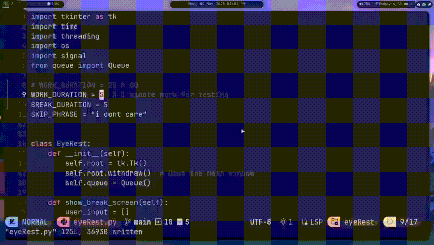

# 🧿 EyeRest

**Take care of your eyes.**  
This small app reminds you to take a short break every 20 minutes by showing a full-screen message:

Built with 💙 using Python and Tkinter.

#### Demo of manual running



---

## 🖥️ Supported Platforms

- ✅ **Linux** (Debian, Arch, Fedora)
- ✅ **macOS** (Homebrew-supported)
- 🟡 **Windows** – _Manual setup supported, install script coming soon_

---

## ⚡ Quick Install (Linux/macOS)

Run this in your terminal:

```bash
bash -c "$(curl -fsSL https://raw.githubusercontent.com/achyutem/eyerest/main/install.sh)"
```

The script will:

- Detect your OS & package manager

- Install python3 and tkinter if missing

- Clone the repo to ~/.local/share/eyeRest

- Add a launcher in your app menu

## 🛠️ Manual Setup (All platforms including Windows)

1. Clone the repo or download the files:

```
git clone https://github.com/anon/save-your-eyes.git
cd save-your-eyes
```

2. Install Python 3 if not already installed:

   Download Python for Windows

   Use your package manager on Linux/macOS

3. Ensure Tkinter is installed (it's included by default on many systems):

   **Debian/Ubuntu**:
   `sudo apt install python3-tk`

   **Arch Linux**:
   `sudo pacman -S tk`

   **Fedora**:
   `sudo dnf install python3-tkinter`

   **macOS (Homebrew)**:
   `brew install python tcl-tk`
   You may need to set PATH to use the brewed Python.

   **Windows**: Tkinter is included with the standard Python installer.

4. Run it:

   `python3 eyeRest.py`

### 🙈 How to Skip a Break

While the break screen is active, type:
`i dont care`
This will close the break screen immediately. Input is hidden for simplicity.

### ⚙️ Customize Timing

Default:

    20 minutes work

    1 minute break

To change this, open eyeRest.py and edit:

```
WORK_DURATION = 20 * 60  # 20 minutes
BREAK_DURATION = 60      # 1 minute
```

🧠 Why EyeRest?

- Follows the 20-20-20 rule (every 20 mins, look 20 ft away for 20 secs)

- Helps prevent digital eye strain (CVS)

- Simple, fast, and no network needed

- Easy to modify and extend (just Python)

### ❤️ Stay Healthy

Protect your eyes — they're the only pair you've got.
EyeRest helps you build better screen habits, one break at a time.
